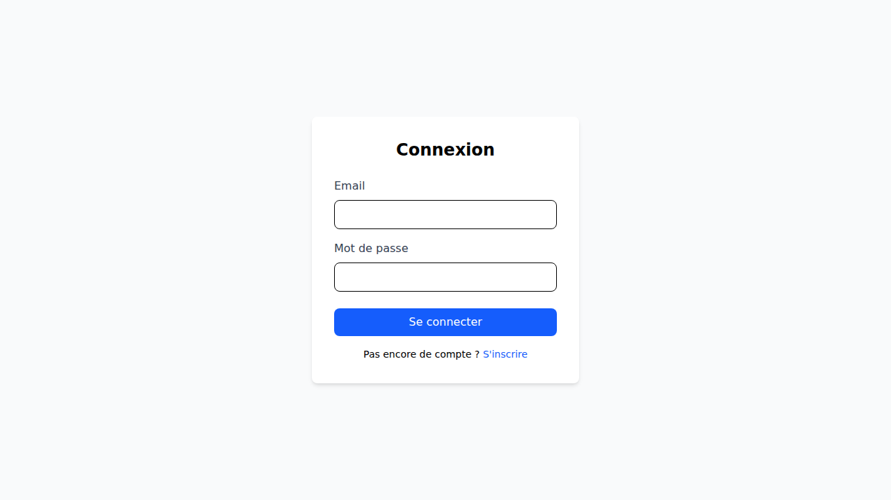
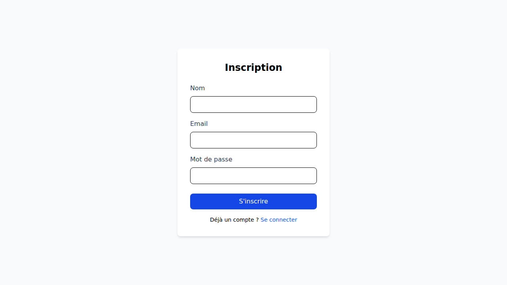

# 🚀 InvoiceKit - Frontend

InvoiceKit est une application moderne de gestion de facturation conçue pour simplifier la vie des entrepreneurs et des petites entreprises. Cette interface élégante et intuitive permet de gérer vos clients, de suivre vos factures et d'analyser vos revenus en un coup d'œil.

---

## ✨ Fonctionnalités Clés

- 📊 **Tableau de Bord Intuitif** : Visualisez vos revenus mensuels avec des graphiques dynamiques.
- 🧾 **Gestion des Factures** : Créez, modifiez et suivez l'état de vos factures (payées, en attente).
- 👥 **Gestion des Clients** : Centralisez les informations de vos clients pour une facturation rapide.
- 🌓 **Mode Sombre** : Une interface qui s'adapte à vos préférences pour un confort visuel optimal.
- 🔐 **Authentification Sécurisée** : Système complet d'inscription et de connexion.
- 📱 **Design Responsive** : Une expérience fluide sur ordinateur, tablette et mobile grâce à Tailwind CSS.

---

## 🛠️ Stack Technique

L'application repose sur les technologies les plus performantes de l'écosystème web moderne :

- **Framework** : [Vue 3](https://vuejs.org/) (Composition API)
- **Build Tool** : [Vite](https://vitejs.dev/)
- **Gestion d'État** : [Pinia](https://pinia.vuejs.org/)
- **Routage** : [Vue Router](https://router.vuejs.org/)
- **Styling** : [Tailwind CSS](https://tailwindcss.com/)
- **Graphiques** : [Chart.js](https://www.chartjs.org/) & [vue-chartjs](https://vue-chartjs.org/)
- **Client HTTP** : [Axios](https://axios-http.com/)

---

## 📸 Aperçu

### Page de Connexion


### Page d'Inscription


---

## 🚀 Installation & Lancement

### Prérequis
- Node.js (version 20.19.0 ou supérieure)
- npm

### Installation des dépendances
```bash
npm install
```

### Lancement en mode développement
```bash
npm run dev
```

### Construction pour la production
```bash
npm run build
```

### Vérification du code (Linting)
```bash
npm run lint
```

---

## 📂 Structure du Projet

```text
src/
├── assets/         # Ressources statiques (images, styles globaux)
├── components/     # Composants Vue réutilisables
├── composables/    # Logique métier partagée (Hooks)
├── plugins/        # Configuration des plugins (Axios, etc.)
├── router/         # Configuration des routes de l'application
├── stores/         # Gestion de l'état avec Pinia
├── views/          # Pages de l'application
├── App.vue         # Composant racine
└── main.ts         # Point d'entrée de l'application
```

---

## 📝 Licence

Ce projet est sous licence MIT.
